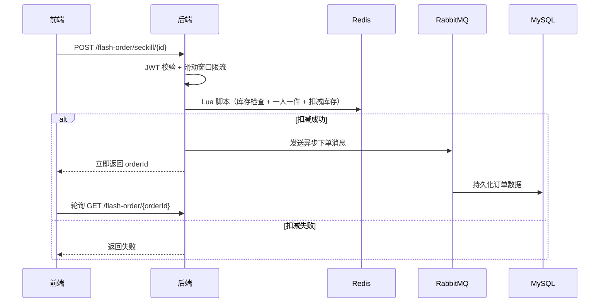

# 闲淘（XianTao）· 校园二手闲置交易平台

> 一个基于 Spring Boot + Redis + MySQL + RabbitMQ 的二手闲置交易平台，支持商品发布、同城附近搜索、"想要"收藏、捡漏抢购与晒物社区，核心思路类似闲鱼 / 转转的校园版。

[](https://opensource.org/licenses/MIT)

## 📑 目录

- [技术栈](#-技术栈)
- [功能亮点](#-功能亮点)
- [捡漏系统架构](#-捡漏系统架构)
- [项目结构](#-项目结构)
- [快速开始](#-快速开始)
- [主要接口](#-主要接口)
- [API 文档](#-api-文档)
- [更新日志](#-更新日志)
- [已完成升级](#-已完成升级)
- [未来规划](#-未来规划)

## 🛠 技术栈

| 类别 | 技术 | 说明 |
|------|------|------|
| 后端框架 | Spring Boot 2.7.18 | 核心业务逻辑 |
| ORM | MyBatis Plus 3.4.3 | 数据库操作 |
| 数据库 | MySQL 8.0 | 持久化存储 |
| 缓存 | Redis 7.0+ | GEO 附近商品搜索、ZSet 想要/点赞、Lua 库存扣减、滑动窗口限流 |
| 消息队列 | RabbitMQ | 捡漏异步下单、死信队列补偿、私信消息持久化 |
| 分布式锁 | Redisson | 分布式锁兜底 |
| 前端 | Vue.js + Element UI + Axios | 多页面应用 |
| Web 服务器 | Nginx 1.18.0 | 前端部署、反向代理 |
| 认证 | JWT + Redis Token | 双拦截器校验、ThreadLocal 线程隔离 |
| API 文档 | Knife4j 4.3.0 | OpenAPI3 在线接口文档 |
| 构建工具 | Maven + Docker | 依赖管理与打包、Compose 一键部署 |

## ✨ 功能亮点

- **商品发布**：登录用户可发布二手商品（名称、分类、图片、成色、售价、交易地址），自动关联卖家与定位。
- **商品搜索**：支持按关键字模糊搜索与按分类分页浏览；基于 Redis GEO 实现按距离排序的同城附近商品滚动分页。
- **想要 / 收藏**：基于 Redis ZSet 实现"想要"标记，一键切换想要状态，展示"想要 TA 的人"前 5 名用户头像。
- **捡漏抢购**：Redis + Lua 脚本原子扣减库存（库存检查 + 一人一件 + 扣减）+ RabbitMQ 异步下单 + 死信队列补偿，避免超卖与瞬时峰值。
- **用户认证**：JWT 令牌 + Redis 双拦截器校验，通过 ThreadLocal 传递用户上下文，支持自动续期。
- **晒物社区**：围绕闲置好物发布图文笔记（可关联商品），支持点赞（ZSet 排行）、评论、关注取关、共同关注、Feed 流推送。
- **私信聊天**：支持一对一实时私信，未读红点提醒，全部已读。
- **个人主页**：粉丝/关注列表、BitMap 签到打卡、昵称头像编辑、个人资料修改。

## 🏗 捡漏系统架构



## 📁 项目结构

```
hmdp/
├── hm-dianping/                          # Spring Boot 后端
│   ├── src/main/java/com/xiantao/
│   │   ├── config/                       # 配置类（MVC、Redis、RabbitMQ、Knife4j）
│   │   ├── controller/                   # 接口层（11 个 Controller）
│   │   ├── service/                      # 业务逻辑层
│   │   │   └── impl/                     # 服务实现
│   │   ├── mapper/                       # MyBatis 数据访问层
│   │   ├── entity/                       # 实体类
│   │   ├── dto/                          # 数据传输对象
│   │   └── utils/                        # 工具类（JWT、Redis 缓存、雪花ID、MQ消费者等）
│   ├── src/main/resources/
│   │   ├── application.yaml              # 主配置
│   │   ├── seckill.lua                   # Lua 抢购脚本（库存扣减 + 一人一件）
│   │   ├── rate_limit.lua                # Lua 滑动窗口限流脚本
│   │   └── unLock.lua                    # Lua 分布式锁释放脚本
│   ├── xiantao.sql                        # 数据库初始化脚本（创建 xiantao 库 + 种子数据）
│   ├── pom.xml
│   └── Dockerfile
├── nginx-1.18.0/                         # Nginx + 前端静态文件
│   └── html/xiantao/                      # 前端页面
│       ├── index.html                    # 首页（分类导航 + 同城推荐）
│       ├── goods-list.html               # 商品列表（分类浏览 / 关键字搜索）
│       ├── goods-detail.html             # 商品详情（想要按钮 + 想要 TA 的人）
│       ├── note-detail.html              # 晒物笔记详情
│       ├── note-edit.html                # 发布晒物（可关联商品）
│       ├── goods-edit.html               # 发布商品（照片/名称/价格/分类/成色/区域/描述）
│       ├── info.html                     # 个人主页
│       ├── info-edit.html                # 编辑资料
│       ├── other-info.html               # 他人主页
│       ├── chat.html                     # 私信聊天
│       ├── message.html                  # 消息列表
│       ├── login.html / login2.html      # 登录页
│       ├── css/                          # 样式
│       ├── js/                           # 脚本（Vue、Axios、Element UI）
│       └── imgs/                         # 图片资源
├── docs/                                 # 部署笔记、压测报告、面试整理等文档
├── docker-compose.yml                    # Docker Compose 一键部署
└── README.md
```

## 🚀 快速开始

### 环境准备

| 组件 | 版本 | 说明 |
|------|------|------|
| JDK | 17+ | 后端运行环境 |
| MySQL | 8.0+ | 持久化存储 |
| Redis | 7.0+ | 缓存与分布式操作 |
| RabbitMQ | 3.8+ | 消息队列（仅测试私信/评论等功能时可省略） |
| Nginx | 1.18.0+ | 前端部署与反向代理 |
| Maven | 3.6+ | 项目构建 |
| Docker & Compose | — | 可选，推荐使用 |

### 方式一：Docker Compose（推荐）

```bash
# 克隆项目
git clone https://github.com/orange-orunji/hmdp.git
cd hmdp

# 启动所有服务（MySQL、Redis、后端、Nginx）
docker-compose up -d

# 初始化数据库（首次执行，替换 your_password 为实际密码）
docker exec -i mysql-container mysql -uroot -p'your_password' < hm-dianping/xiantao.sql

# 浏览器访问 http://localhost
```

### 方式二：本地运行

1. **初始化数据库**
   ```bash
   mysql -u root -p < hm-dianping/xiantao.sql
   ```

2. **修改配置**
   编辑 `hm-dianping/src/main/resources/application.yaml`，填写你的 MySQL、Redis、RabbitMQ 连接信息（默认连接 `192.168.161.128:3306/xiantao`、Redis 7000 端口）。

3. **启动后端**
   ```bash
   cd hm-dianping
   mvn spring-boot:run
   ```

4. **配置 Nginx**
   将前端文件放入 Nginx 的 `html/xiantao/` 目录，添加反向代理配置：
   ```nginx
   location /api {
       proxy_pass http://localhost:8081;
   }
   ```

5. **访问**
   浏览器打开 `http://localhost` 即可看到前端页面。

## 📊 主要接口

| 模块 | 接口示例 | 说明 |
|------|----------|------|
| 商品详情 | `GET /goods/{id}` | 查询商品详情 |
| 分类浏览 | `GET /goods/of/type?typeId=1&current=1` | 按分类分页查询商品 |
| 关键字搜索 | `GET /goods/of/name?name=键盘` | 按名称模糊搜索商品 |
| 附近搜索 | `GET /goods/of/type?typeId=1&x=39.9&y=116.4` | 按距离查询同城附近商品 |
| 发布商品 | `POST /goods` | 卖家发布二手商品 |
| 想要/取消 | `PUT /goods/want/{id}` | 想要 / 取消想要商品 |
| 想要列表 | `GET /goods/wants/{id}` | 想要该商品的前 5 名用户 |
| 捡漏活动 | `GET /flash-sale/list/{goodsId}` | 查询商品关联的捡漏活动 |
| 捡漏抢购 | `POST /flash-order/seckill/{id}` | 捡漏活动抢购（Lua + MQ 异步下单） |
| 订单查询 | `GET /flash-order/{orderId}` | 轮询查询下单结果 |
| 登录 | `POST /user/login` | 手机号验证码登录 |
| 晒物 | `GET /note/hot?current=1` | 热门晒物笔记列表 |
| 评论 | `POST /note-comments` | 发表晒物评论 |
| 私信 | `POST /message` | 发送私信 |
| 会话 | `GET /message/conversations` | 私信会话列表（含未读数） |
| 关注 | `PUT /follow/{id}/{isTrue}` | 关注/取关 |
| 签到 | `POST /user/sign` | 每日签到 |
| 资料 | `PUT /user/me` | 修改昵称头像 |

## 📖 API 文档

项目已集成 Knife4j，启动后端后访问：

```
http://localhost:8081/doc.html
```

## 📝 更新日志

- **2026-08-08**：新增发布商品页 `goods-edit.html`（底部"+"弹出发布菜单：发布商品 / 发晒物；晒物关联商品弹窗支持跳转发布）；全站 UI 升级为 B 站风格（粉紫主色 #FB7299/#A879F2、CSS 变量体系、大圆角卡片、渐变按钮、Element UI 主题色替换 143 处）
- **2026-08-08**：项目魔改为「闲淘」二手闲置交易平台——包名 `com.hmdp` → `com.xiantao`，业务映射：商户→商品、优惠券→捡漏活动、博客→晒物笔记；新增商品发布 / 想要收藏 / 分类与关键字搜索；全站前端文案与页面改造；数据库脚本重写（xiantao 库 + 13 张表 + 二手种子数据）
- **2026-06-23**：新增私信聊天系统（实时私信、未读红点、全部已读）
- **2026-06-23**：完善晒物评论系统（发表评论、评论列表展示）
- **2026-06-23**：完善个人主页（粉丝/关注列表、昵称头像编辑、个人资料修改）
- **2026-06-21**：RabbitMQ 消息队列完善捡漏下单（MQ 异步下单、死信队列、轮询查询接口）
- **2026-06-19**：Docker 一键部署
- **2026-06-17**：部署到 Linux 服务器、初始化 README
- **2026-05-20**：新增 Redis HyperLogLog UV 统计与 GEO 附近商品滚动查询
- **2026-05-19**：开发共同关注功能
- **2026-05-14**：上传核心业务代码
- **2026-05-09**：项目初始化，提交数据库脚本

## ✅ 已完成升级

从最初的 Demo 级项目，已完成的架构升级：

- **消息队列异步化**：接入 RabbitMQ，将捡漏下单异步化，配合死信队列实现重试机制，平滑峰值流量。
- **Lua 原子操作**：库存扣减、一人一件、限流均使用 Lua 脚本保证原子性，替代复杂分布式锁方案。
- **压测与 JVM 调优**：通过 JMeter 全链路压测，借助 Arthas 分析热点代码，最终输出 QPS 3000+ 的性能报告。

## 🔮 未来规划

### 🎯 业务功能增强

1. **交易闭环**  
   目前商品仅支持发布/浏览，计划补齐「想要 → 下单 → 订单状态流转」完整交易链路，复用现有 Lua 脚本 + RabbitMQ 异步下单架构处理多人同时拍下的超卖问题。

2. **WebSocket 实时私信**  
   当前私信为轮询拉取，升级为 WebSocket 实时推送，同时打通系统通知（卖出提醒、点赞通知）。

3. **议价功能**  
   在私信消息中增加「出价」消息类型，买卖双方可在聊天中议价并一键确认改价。

4. **体验细节优化**  
   图片懒加载、骨架屏、暗黑模式、发布页图片压缩。

### 🏗 架构升级（高并发深度版）

1. **Elasticsearch 商品搜索**  
   搭建 Elasticsearch 集群，支持商品全文检索、搜索建议、价格区间过滤等高级功能（已建独立分支开发）。

2. **Canal 数据同步**  
   监听 MySQL binlog，实时更新 Redis 缓存与 Elasticsearch 索引，解决缓存一致性难题。

3. **多级缓存**  
   引入 Caffeine 本地缓存 + Redis 分布式缓存，配合逻辑过期与布隆过滤器，大幅提升查询性能。

4. **读写分离与分表**  
   利用 ShardingSphere 实现数据库读写分离、订单分表，应对海量数据存储需求。

---

## 👤 贡献者

- [orange-orunji](https://github.com/orange-orunji)

## 📄 许可证

本项目基于 [MIT License](LICENSE) 开源，修改及分发时请保留原始版权声明。
